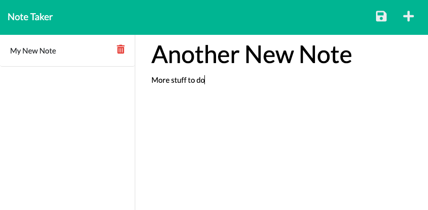

# Note Taker
<p />By Michael Martens

[](https://opensource.org/licenses/MIT)

## Description
Use this tool to keep track of any list! You can add notes, view, and delete them.

Check out an example video [here](INSERT).


<br>

## Table of Contents
[Installation](#installation)<br />[Usage](#usage)<br />[License](#license)<br />[Contributing](#contributing)<br />[Tests](#tests)<br />[Questions](#questions)

## Installation
Clone the repo > run ```npm install``` to intialize the included dependencies > run ```node start``` to launch the app > visit ```localhost:3001``` got get started.

## Usage
To use the app in production, visit the [Heroku](https://stark-beyond-57443.herokuapp.com) instance.

To add a note, click in the title and text fields to enter your values and then select the Save icon. To delete a note, select the trash can next to any specific note.

## License
This project is licensed under the MIT license.

A short and simple permissive license with conditions only requiring preservation of copyright and license notices. Licensed works, modifications, and larger works may be distributed under different terms and without source code.<p />For more information visit https://choosealicense.com/licenses/mit/.

## Contributing
Other than what I learned in class, just myself! I grabbed most of my inspiration from the provided resources.

## Tests
None

## Questions
Find me on Github at https://github.com/makeithappenmike<p/>You can reach me at omichaelaaron@gmail.com if you have any questions.